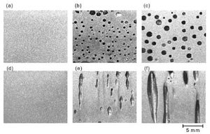
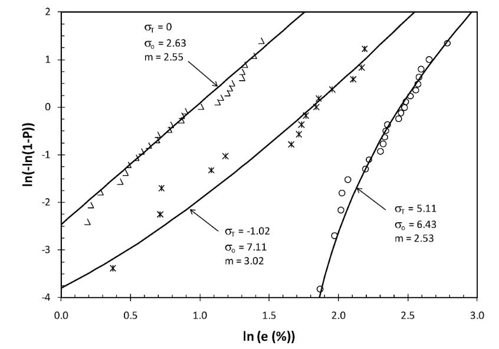
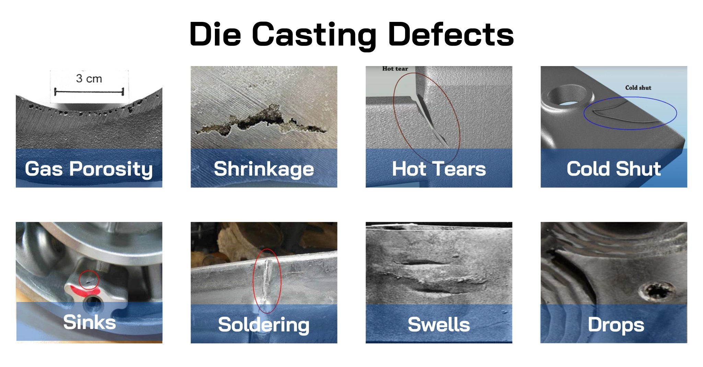

# 1. Die Cast Defect Detection (Ch.2) 
One main obstacle in die-casting is the presence of porosity. This is the entrapment of a gas in the metal that causes bubbles of pockets. The image depicts examples of porosity [1] The presence of porosity can cause a part to become defective if the location of it is in a critical area, or there is so much of it, that the porosity reduces the structural integrity of the component. For a run of 10,000 parts, the following table depicts the number of parts classified by present porosity and if it is a defective part. The data was collected from a production run from May 23-26 at a die caster located in Chicago, IL [3]. The part could also be defective from other sources. 
<center>


</center>


```{r 2-1, echo=FALSE}
library(kableExtra)
library(knitr)
df1 = data.frame(y=c("Defective","Not Defective","Total"),y1=c(865,112,987),y2=c(748,8265,9013),y3=c(1613,8387,10000))
names(df1) <- c("","Porosity","No Porosity","Total")

kable(df1,"latex",align="c", caption="Classified Parts",label="5-6a",escape = FALSE) %>%
    kable_styling(latex_options = "hold_position")
```

## a) A standard defect rate for a die cast part is less than 10%. Determine if this part meets that standard and what is the defect rate for a part that has no prosity.

Let A denote a part with no porosity and B denote a part being defective. Find $P(B)$ and $P(A \cap B)\\$
$P(B) =\frac{1613}{10000}=0.1613\: \therefore$ the part does not meet the standard defect rate of less than 10% 
$\\ P(A \cap B) =\frac{748}{10000}=0.0748$ If a part has no porosity, its defect rate is 7.48%


## b) Find the probability of a part being defective given it has porosity
$P(B|A') = \frac{P(A'\cap B)}{P(A')} =\frac{865}{987}=0.8763$

## c) How many defective parts did not have porosity?
$P(A' \cap B) = \frac{748}{1613}=0.4637$

## d) 


# 2. ChatGPT detection propability (Ch.3)

ChatGPT has exploded in popularity recently, and people are eager to utilize its potential. Professors at for-profit universities have taken to ChatGPT to create exam questions and solutions for them to save time and effort. The professors are cheap and only use the free version of ChatGPT which is known to only have a 18% success rate of creating correct solution sets. 

## a) What is the probability that exactly 9 out of 10 solutions are correct if ChatGPT is used?

$P(X=9)={10\choose 9} (0.82)^9(0.18)^{10-9}=1.626\times10^{-6}$
```{r 3-a}
dbinom(9,10,.18)
```

## b) What is the probability that at least 5 out of 10 solutions are correct if ChatGPT is used?
$P(X\ge5)=\sum\limits_{x=5}^{10}{10\choose x} (0.82)^x(0.18)^{10-x}=0.003669387$

```{r 3-b}
pbinom(5,10,.18, lower.tail=FALSE)
```

## c) What is the probability of a student catching the proffessors error within 24 hours if every 18 hours the solution manual is opened by a random student?
$\lambda T = 18\: hours\\$
$P(X=24)=\frac{e^{-18}18^24}{24!}=0.9317$
```{r 3-c}
ppois(3,1.5)
```

# 3. Die Casting Defects - Weibull (Ch.4)

  The need for stronger automotive aluminum die cast components has steadily grown with the need to reduce weight and increase strength of cars. Fracture mechanics state that 'ideal' characteristics can never be observed in real life due to the presence of defects. These defects are modeled as statistical distributions. Wallodi Weibull introduced a new distribution that is widely used to model defects in metals [2]. 
  The material in question is sand cast Aluminum Alloy 319. This alloy is widely used in structural castings for engine components. The equations below model the probability density function and cumulative density functions of the probability of failure at the given elongation. The figure below shows the dataset that was used to obtain the the threshold $\sigma_t$, scale $\sigma_o$, and shape *m*, parameters.

<center>



</center>


PDF: $f(x) = \left(\frac{2.53}{6.43}\right)\left(\frac{x-5.11}{6.43}\right)^{1.53}\exp\left(-\left(\frac{x-5.11}{6.43}\right)^{2.53}\right)$
CDF: $F(x) =1-\exp\left(-\left(\frac{\left(x\right)}{6.43}\right)^{2.53}\right)$


## a) Determine the probability of failure before an elongation of 7.2%?
$P(X\le 7.2) = F(7.2) = 1-e^{-(\frac{7.2}{6.43})^{2.53}}=0.7358$
```{r 4-a}
pweibull(7.2,2.53,6.43)
```


## b) Determine what elongation % A319 can survive 85% of the time?
$P(X>x) = 1-P(X\le x) = 1-F(x) = e^{-(\frac{x}{6.43})^{2.53}}=0.85\\$
Solve for x, $x=3.13556 % \\$
Checking solution:
```{r 4-b}
1-pweibull(3.13556,2.53,6.43)
```

## c) If 100 castings are tested, what is the probability that 85 will not fail till 2.0% elongation?
Let X be the number of castings that pass at 2% elongation. Then X is a binomial random variable.
$P(X\le 2.0) = F(2.0) = 1-e^{-(\frac{2.0}{6.43})^{2.53}}=0.1352596$
$P(X=85) = {100\choose 85}*0.1352596^{85}*(1-0.1352596)^{100-85} = 0.726001$

```{r 4-c}
sum(dbinom(85:100,100,1-0.1352596))
```


## d) What is the mean elongation and variance at which failure occurs?
$E(X) = 6.43*\Gamma \left( 1 + \frac{1}{2.53}\right)=5.70683\\$
$V(X) = 6.43^2\Gamma \left( 1+ \frac{2}{2.53} \right)-6.43^2 \left[ \Gamma\left( 1 + \frac{1}{2.53}\right) \right] ^2=5.837331$

```{r 4-d}
6.43*gamma(1+ (1/2.53))
6.43^2*gamma(1+(2/2.53))-6.43^2*(gamma(1+(1/2.53)))^2
```


# 4. Die Casting Defects (Ch.5)

  During high-pressure die casting, various defects can come up in a part that when checked by the Quality department, will cause the part to fail inspection. Some of theses types of defects are porosity, non-fill, and solder. The image below shows such examples [4]. These defects are easy to detect but extremely difficult to prevent. The die casting process has hundreds of process variables, many of which can not be fully controlled. For example, the ambient humidity can severely impact the process requiring changes to other process parameters to counteract the humidity's effect. 
  The following data was collected at a die casting plant in Chicago, Illinois that I work at for a problematic part for all of 2022 [3]. Over 500 individual parts were made and analyzed during the trial period. The data collection was part of an effort to study the impact of humidity and what parameters positively impacted the manufacturing process. Humidity levels were categorized to 'low', 'medium', and 'high'. The various probabilities of each defect occurring are displayed in the joint probabilty distribution table below. The data has been simplified to better fit the question at hand.   

<center>


</center>

```{r 5, echo=FALSE}
library(kableExtra)
library(knitr)
df1 = data.frame(y=c("Low","Medium","High"),p=c(0.012,0.06,0.17),nf=c(0.08,0.09,0.21),dim=c(0,0.02,0.01),solder=c(0.01,0.03,0.09),OK=c(0.108,0.10,0.01))
names(df1) <- c("Humidity","Porosity (1)","Non-Fill (2)","Dimensional (3)","Solder (4)","OK (5)")

kable(df1,"latex",align="c", caption="PMF",label="5-6a",escape = FALSE) %>%
    kable_styling(latex_options = "hold_position")
```

## a) Determine the margnial probability distributions for each defect type and humidity level.  

```{r 5-a, echo=FALSE}
library(kableExtra)
library(knitr)
df1 = data.frame(y=c("Low","Medium","High","$f_d(d)$"),p=c(0.012,0.06,0.17,0.242),nf=c(0.08,0.09,0.21,0.38),dim=c(0,0.02,0.01,0.03),solder=c(0.01,0.03,0.09,0.13),OK=c(0.108,0.10,0.01,0.218),fx=c(0.21,0.3,0.49,1))
names(df1) <- c("Humidity","Porosity (1)","Non-Fill (2)","Dimensional (3)","Solder (4)","OK (5)","$f_h(h)$")

kable(df1,"latex",align="c", caption="PMF",label="5-6a",escape = FALSE) %>%
    kable_styling(latex_options = "hold_position")
```


## b) Given it is a high humidity day, what is the probability that the part will have porosity? Any defect?
$P(D=1|H=3) = \frac{0.17}{0.49}=0.3469\\$
$P(0<D<4|H=3) = \frac{0.17+0.21+0.01+0.09}{0.49}=0.97959\\$

## c) 


## d) Are defects and humidity independent?
$\because f_{1|3}(1) \ne f_d(1) \:therefore \: NOT \: independent$

\newpage
# References
[1] https://www.sunrise-casting.com/capability/aluminum-die-casting-production.html 

[2] https://link.springer.com/chapter/10.1007/978-3-319-48130-2_26  

[3] Gardocki, Patrick. *Trial Data for PN 198006*. Unpublished

[4] https://www.rapiddirect.com/blog/17-types-of-casting-defects/?rdtm_from=sns 